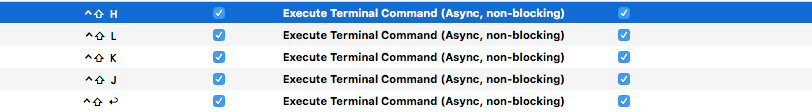

## wmctrl ⌨️ 

- So this is based on / guided by https://github.com/koekeishiya/chunkwm's common library but it's like a little utility.

- So you can control the focused window.

- And do cool things hooked up to [*skhd*](https://github.com/koekeishiya/skhd) or [*khd*](https://github.com/koekeishiya/khd) or e.g. [*BetterTouchTool*](https://folivora.ai/).

